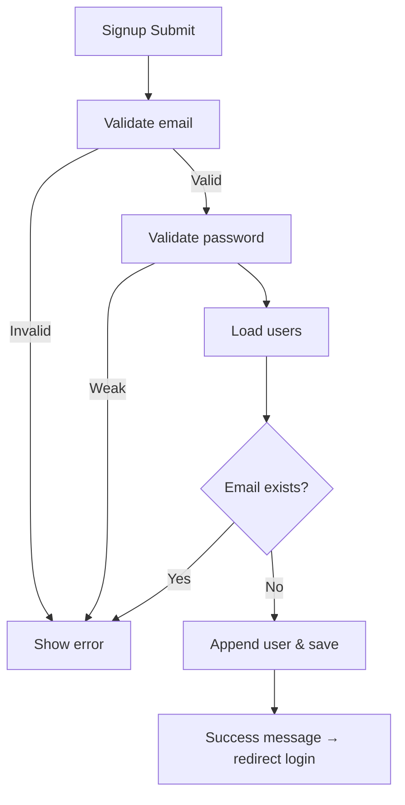
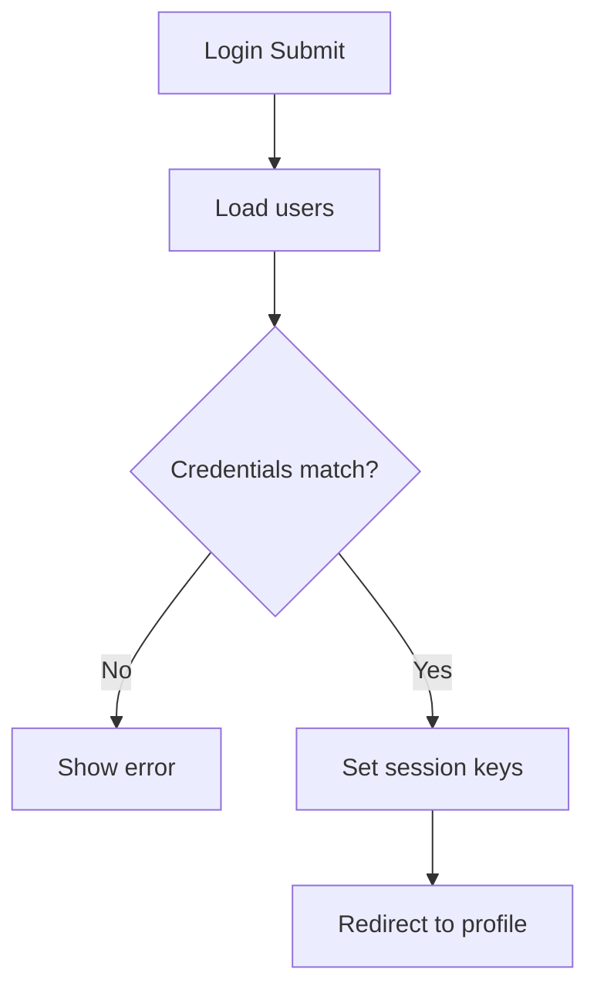

# Methods Plan and Pseudocode

This document details the modules (modeled as classes), their methods, responsibilities, flowcharts for complex logic, and pseudocode for implementation. It mirrors the modules outlined in `System_Flowcharts.md` Section 12.

## Index of Classes
- Navigation
- AuthService
- UserStore
- ValidationService
- QuizService
- LevelTestService
- SettingsService
- AppInitializer
- LocalStorageAdapter

---

## Navigation

- Responsibilities: Build header/sidebar links, attach event listeners, and handle navigation.

### Methods
- `buildNavbar()`
- `setupNavigation()`
- `addEventListeners(selector, action, callback)`

### Pseudocode
```pseudo
function buildNavbar():
  nav = getElementById("navbar")
  if nav is null: return
  current = getCurrentFileNameFromLocation()
  html = map navItems to anchor HTML with active class for current
  nav.innerHTML = join(html)

function setupNavigation():
  addEventListeners('[data-action="home"]', 'Home button', goto('homepage.html'))
  addEventListeners('[data-action="quizzes"]', 'Quizzes button', goto('quizzes.html'))
  addEventListeners('[data-action="test"]', 'Test button', goto('level-test.html'))
  addEventListeners('[data-action="videos"]', 'Videos button', goto('videos.html'))
  addEventListeners('[data-action="books"]', 'Books button', goto('books.html'))
  addEventListeners('[data-action="profile"]', 'Profile button', goto('profile.html'))
  addEventListeners('[data-action="settings"]', 'Settings button', goto('settings.html'))

function addEventListeners(selector, action, callback):
  for each element in querySelectorAll(selector):
    element.addEventListener('click', () => { log(action + ' clicked'); callback() })
    element.addEventListener('touchstart', (e) => { e.preventDefault(); log(action + ' tapped'); callback() })
```

---

## AuthService

- Responsibilities: Signup, login, logout, and current session management.

### Methods
- `signupUser(username, email, password) -> Result`
- `loginUser(email, password) -> Result`
- `logoutUser() -> void`
- `getCurrentUser() -> User|null`

### Complex Flow: Signup and Login




### Pseudocode
```pseudo
function signupUser(username, email, password) -> Result:
  users = getUsers()
  if not isValidEmail(email): return { success: false, message: 'Invalid email' }
  pw = validatePassword(password)
  if not pw.success: return { success: false, message: pw.message }
  if exists u in users where u.email == email:
    return { success: false, message: 'Email already exists' }
  push users with { username, email, password }
  saveUsers(users)
  return { success: true, message: 'Account created' }

function loginUser(email, password) -> Result:
  users = getUsers()
  user = find in users where email == email and password == password
  if user is null: return { success: false, message: 'Invalid email or password' }
  localStorage.setItem('loggedIn', 'true')
  localStorage.setItem('currentUser', JSON.stringify(user))
  return { success: true, user }

function logoutUser():
  localStorage.removeItem('loggedIn')
  localStorage.removeItem('currentUser')

function getCurrentUser() -> User|null:
  return JSON.parse(localStorage.getItem('currentUser') || 'null')
```

---

## UserStore

- Responsibilities: Retrieve and persist the users collection.

### Methods
- `getUsers() -> User[]`
- `saveUsers(users: User[]) -> void`

### Pseudocode
```pseudo
function getUsers() -> User[]:
  raw = localStorage.getItem('users')
  return JSON.parse(raw || '[]')

function saveUsers(users: User[]):
  localStorage.setItem('users', JSON.stringify(users))
```

---

## ValidationService

- Responsibilities: Input validation and user messages.

### Methods
- `isValidEmail(email) -> boolean`
- `validatePassword(password) -> Result`
- `showMessage(message, type, elementId) -> void`

### Pseudocode
```pseudo
function isValidEmail(email) -> boolean:
  return regex('^[^\s@]+@[^\s@]+\.[^\s@]+$').test(email)

function validatePassword(password) -> Result:
  if length(password) < 6: return { success: false, message: 'Password must be at least 6 characters long' }
  return { success: true, message: 'Password is valid' }

function showMessage(message, type = 'info', elementId = 'message'):
  el = getElementById(elementId)
  if el is null: return
  el.textContent = message
  el.style.color = (type == 'error') ? '#ef4444' : (type == 'success') ? '#10b981' : '#6b7280'
```

---

## QuizService

- Responsibilities: Persist and retrieve quiz attempt results.

### Methods
- `storeQuizResults(results) -> void`
- `getQuizResults() -> QuizAttempt|null`

### Pseudocode
```pseudo
function storeQuizResults(results):
  localStorage.setItem('quizResults', JSON.stringify(results))

function getQuizResults() -> QuizAttempt|null:
  raw = localStorage.getItem('quizResults')
  return raw ? JSON.parse(raw) : null
```

---

## LevelTestService

- Responsibilities: Persist and retrieve level test results.

### Methods
- `storeLevelTestResults(results) -> void`
- `getLevelTestResults() -> LevelTestResult|null`

### Pseudocode
```pseudo
function storeLevelTestResults(results):
  localStorage.setItem('levelTestResults', JSON.stringify(results))

function getLevelTestResults() -> LevelTestResult|null:
  raw = localStorage.getItem('levelTestResults')
  return raw ? JSON.parse(raw) : null
```

---

## SettingsService

- Responsibilities: User preferences and destructive operations (reset, delete).

### Methods
- `changeFont(font) -> void`
- `resetData() -> boolean`
- `deleteAccount() -> boolean`

### Pseudocode
```pseudo
function changeFont(font):
  document.body.style.fontFamily = font or 'Inter, sans-serif'
  localStorage.setItem('preferredFont', font)

function resetData() -> boolean:
  try: localStorage.clear(); return true
  catch: log(error); return false

function deleteAccount() -> boolean:
  try: localStorage.clear(); return true
  catch: log(error); return false
```

---

## AppInitializer

- Responsibilities: One-time setup on page load; apply preferences; wire navigation; detect session.

### Methods
- `initializeApp() -> void`

### Flowchart
```mermaid
flowchart TD
  A[DOMContentLoaded] --> B[Read preferredFont]
  B --> C{Exists?}
  C -->|Yes| D[Apply font]
  C -->|No| E[Skip]
  D --> F[setupNavigation()]
  E --> F[setupNavigation()]
  F --> G[Check loggedIn]
  G --> H{loggedIn == true?}
  H -->|Yes| I[Log 'User is logged in']
  H -->|No| J[Continue]
```

### Pseudocode
```pseudo
function initializeApp():
  savedFont = localStorage.getItem('preferredFont')
  if savedFont is not null: changeFont(savedFont)
  setupNavigation()
  if localStorage.getItem('loggedIn') == 'true':
    log('User is logged in')
```

---

## LocalStorageAdapter

- Responsibilities: Thin abstraction for storage (implicit in current code; listed for clarity).

### Methods
- `setItem(key, value) -> void`
- `getItem(key) -> any`
- `clear() -> void`

### Pseudocode
```pseudo
function setItem(key, value):
  localStorage.setItem(key, value)

function getItem(key) -> any:
  return localStorage.getItem(key)

function clear():
  localStorage.clear()
```

---

## Data Types (for reference)

```ts
// User { username: string; email: string; password: string }
// QuizAttempt { quizId: string; userEmail: string; answers: number[]; score: number; completedAt: string }
// LevelTestResult { level: string; score: number; completedAt: string }
```
