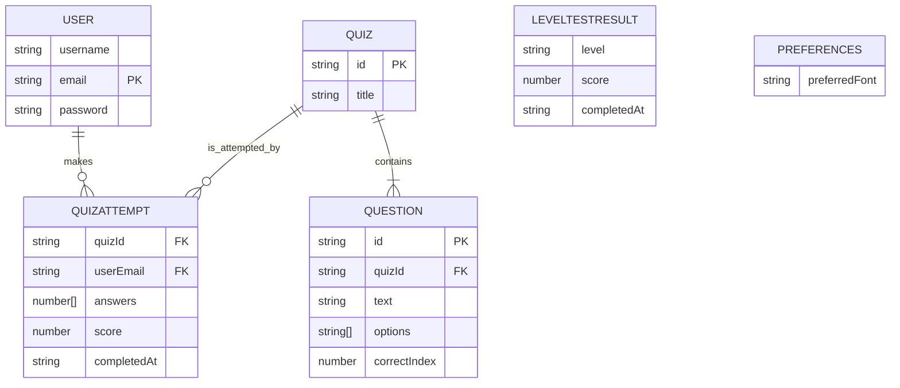
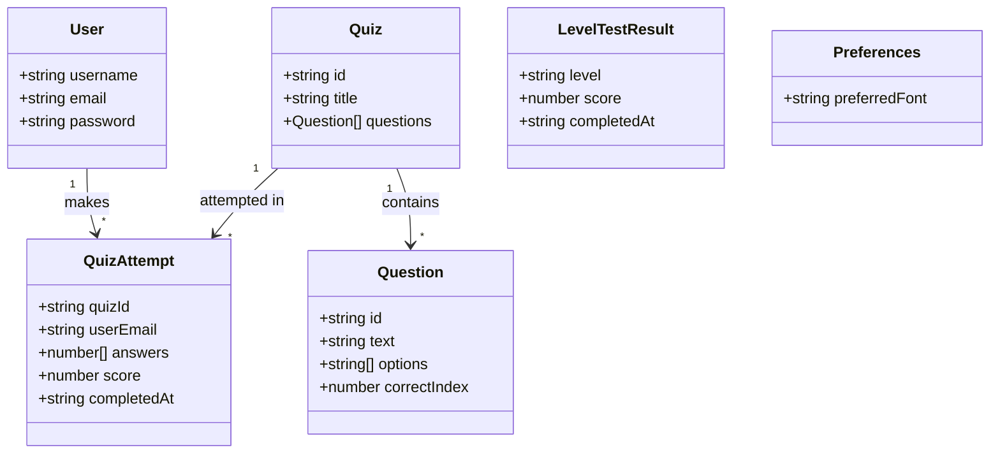
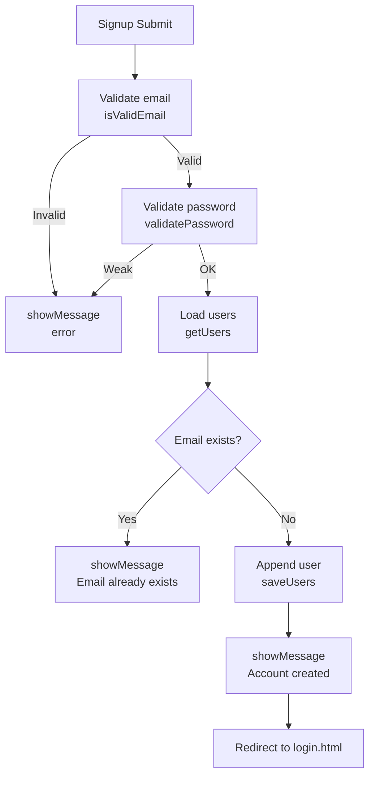
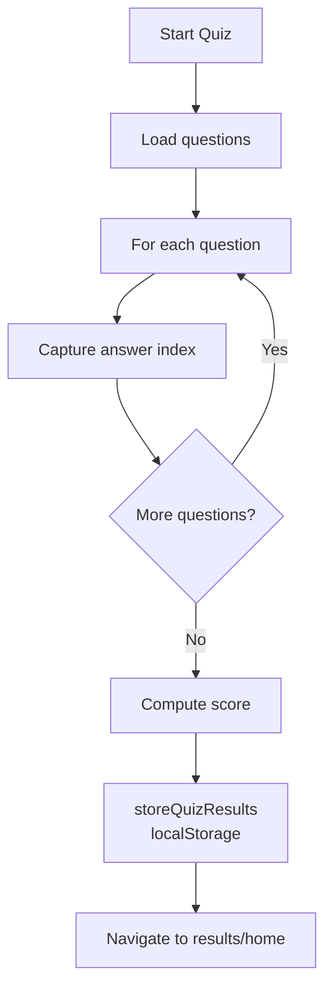
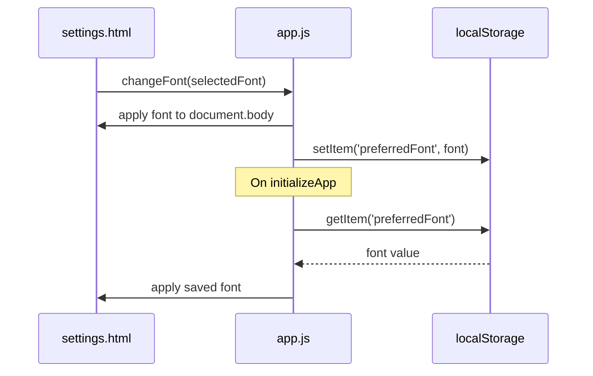
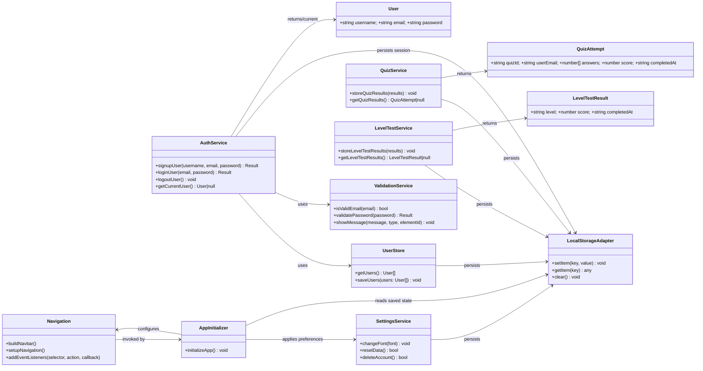

# System Flowcharts and Diagrams

## 1. User Navigation Flowchart

Below is a Mermaid-rendered flowchart of the primary user navigation and outcomes across pages.

```mermaid
flowchart TD
  %% Entry
  A[Homepage\nindex.html] -->|Click Login| B[Login\nlogin.html]
  A -->|Click Sign-up| C[Sign Up\nsignup.html]
  A -->|Get started| D[Home\nhomepage.html]

  %% Login outcomes
  B -->|Submit valid credentials| H{Authenticated?}
  H -->|Yes| P[Profile\nprofile.html]
  H -->|No| E[Show error\nInvalid credentials]
  E --> B

  %% Signup outcomes
  C -->|Submit details| I{Email exists?}
  I -->|No| J[Account created]
  J --> B
  I -->|Yes| F[Show error\nEmail already exists]
  F --> C

  %% Main navigation (sidebar/header)
  D --> Q[Level Test\nlevel-test.html]
  D --> R[Quizzes\nquizzes.html]
  D --> S[Videos\nvideos.html]
  D --> T[Books\nbooks.html]
  D --> P
  D --> U[Settings\nsettings.html]

  %% Level test flow summary
  Q --> V[Level Result\nlevel-result.html]
  V --> D

  %% Quizzes flow summary
  R --> W[Quiz Taking\nquiz-taking.html]
  W --> X[Score saved\nlocalStorage]
  X --> D

  %% Settings
  U --> Y[Change preferences\n(Font, etc.)]
  Y --> D
```

```
┌─────────────────┐
│   Homepage      │
│   (index.html)  │
└─────────┬───────┘
          │
          ├─── Login ────┐
          │              │
          ├─── Signup ───┤
          │              │
          └─── Get Started ──┐
                             │
                             ▼
                    ┌─────────────────┐
                    │  Level Test     │
                    │ (level-test.html)│
                    └─────────┬───────┘
                              │
                              ▼
                    ┌─────────────────┐
                    │  Level Results  │
                    │(level-result.html)│
                    └─────────┬───────┘
                              │
                              ▼
                    ┌─────────────────┐
                    │   Dashboard     │
                    │  (Sidebar Nav)  │
                    └─────────┬───────┘
                              │
                              ├─── Quizzes ────┐
                              │                │
                              ├─── Videos ─────┤
                              │                │
                              ├─── Books ──────┤
                              │                │
                              ├─── Profile ────┤
                              │                │
                              └─── Settings ───┘
```

## 2. User Authentication Flow

```
┌─────────────────┐
│  User Access    │
│  (Login/Signup) │
└─────────┬───────┘
          │
          ▼
┌─────────────────┐
│  Validate Input │
│  (Email/Password)│
└─────────┬───────┘
          │
          ├─── Invalid ────┐
          │                │
          ▼                │
┌─────────────────┐        │
│  Show Error     │        │
│  Message        │        │
└─────────┬───────┘        │
          │                │
          └────────────────┘
          │
          ▼
┌─────────────────┐
│  Check User     │
│  Exists         │
└─────────┬───────┘
          │
          ├─── New User ────┐
          │                 │
          ▼                 │
┌─────────────────┐         │
│  Create Account │         │
│  & Save Data    │         │
└─────────┬───────┘         │
          │                 │
          └─────────────────┘
          │
          ▼
┌─────────────────┐
│  Login Success  │
│  & Redirect     │
└─────────────────┘
```

## 3. Quiz System Flow

```
┌─────────────────┐
│  Start Quiz     │
│  (Select Quiz)  │
└─────────┬───────┘
          │
          ▼
┌─────────────────┐
│  Load Questions │
│  & Initialize   │
└─────────┬───────┘
          │
          ▼
┌─────────────────┐
│  Display        │
│  Question       │
└─────────┬───────┘
          │
          ▼
┌─────────────────┐
│  User Selects   │
│  Answer         │
└─────────┬───────┘
          │
          ▼
┌─────────────────┐
│  Store Answer   │
│  & Check if     │
│  More Questions │
└─────────┬───────┘
          │
          ├─── Yes ────┐
          │            │
          ▼            │
┌─────────────────┐    │
│  Next Question  │    │
└─────────┬───────┘    │
          │            │
          └────────────┘
          │
          ▼
┌─────────────────┐
│  Calculate      │
│  Final Score    │
└─────────┬───────┘
          │
          ▼
┌─────────────────┐
│  Display        │
│  Results        │
└─────────────────┘
```

## 4. Data Storage Flow

```
┌─────────────────┐
│  User Action    │
│  (Save Data)    │
└─────────┬───────┘
          │
          ▼
┌─────────────────┐
│  Validate Data  │
│  Format         │
└─────────┬───────┘
          │
          ├─── Invalid ────┐
          │                │
          ▼                │
┌─────────────────┐        │
│  Show Error     │        │
│  & Return       │        │
└─────────────────┘        │
          │                │
          └────────────────┘
          │
          ▼
┌─────────────────┐
│  Convert to     │
│  JSON String    │
└─────────┬───────┘
          │
          ▼
┌─────────────────┐
│  Store in       │
│  Local Storage  │
└─────────┬───────┘
          │
          ▼
┌─────────────────┐
│  Confirm Save   │
│  Success        │
└─────────────────┘
```

## 5. System Architecture Diagram

```
┌─────────────────────────────────────────────────────────────┐
│                    Englishtopia Application                │
├─────────────────────────────────────────────────────────────┤
│  Presentation Layer (HTML5)                                │
│  ├── index.html (Homepage)                                 │
│  ├── login.html (Authentication)                           │
│  ├── signup.html (User Registration)                       │
│  ├── quizzes.html (Quiz Selection)                         │
│  ├── level-test.html (Assessment)                          │
│  ├── quiz-taking.html (Quiz Interface)                     │
│  ├── videos.html (Video Resources)                         │
│  ├── books.html (Book Resources)                           │
│  ├── profile.html (User Profile)                           │
│  ├── settings.html (User Settings)                         │
│  └── level-result.html (Results Display)                   │
├─────────────────────────────────────────────────────────────┤
│  Styling Layer (CSS3)                                      │
│  ├── style.css (Consolidated Styles)                       │
│  ├── Responsive Design (Mobile-First)                      │
│  ├── Accessibility Features (Dyslexia Support)             │
│  └── Cross-Browser Compatibility                           │
├─────────────────────────────────────────────────────────────┤
│  Logic Layer (JavaScript)                                  │
│  ├── app.js (Main Application Logic)                       │
│  ├── User Management (Authentication)                      │
│  ├── Quiz System (Questions & Scoring)                     │
│  ├── Data Persistence (Local Storage)                      │
│  └── Event Handling (User Interactions)                    │
├─────────────────────────────────────────────────────────────┤
│  Data Layer (Browser Storage)                              │
│  ├── User Data (Profiles, Settings)                        │
│  ├── Quiz Results (Scores, Progress)                       │
│  ├── Application State (Current Session)                   │
│  └── Preferences (Font, Theme, etc.)                       │
└─────────────────────────────────────────────────────────────┘
```

## 6. Component Interaction Diagram

```
┌─────────────┐    ┌─────────────┐    ┌─────────────┐
│   User      │    │   HTML      │    │   CSS       │
│ Interface   │◄──►│   Pages     │◄──►│   Styles    │
└─────────────┘    └─────────────┘    └─────────────┘
       │                   │                   │
       │                   │                   │
       ▼                   ▼                   ▼
┌─────────────┐    ┌─────────────┐    ┌─────────────┐
│ JavaScript  │    │   Event     │    │   Data      │
│ Functions   │◄──►│ Handlers    │◄──►│ Storage     │
└─────────────┘    └─────────────┘    └─────────────┘
       │                   │                   │
       │                   │                   │
       ▼                   ▼                   ▼
┌─────────────┐    ┌─────────────┐    ┌─────────────┐
│   Quiz      │    │   User      │    │   Results   │
│   Logic     │    │ Management  │    │ Processing  │
└─────────────┘    └─────────────┘    └─────────────┘
```

## 7. Error Handling Flow

```
┌─────────────────┐
│  User Action    │
│  (Any Function) │
└─────────┬───────┘
          │
          ▼
┌─────────────────┐
│  Try Execute    │
│  Function       │
└─────────┬───────┘
          │
          ├─── Success ────┐
          │                │
          ▼                │
┌─────────────────┐        │
│  Return Result  │        │
│  to User        │        │
└─────────────────┘        │
          │                │
          └────────────────┘
          │
          ▼
┌─────────────────┐
│  Catch Error    │
│  (if any)       │
└─────────┬───────┘
          │
          ▼
┌─────────────────┐
│  Log Error      │
│  & Show User    │
│  Friendly       │
│  Message        │
└─────────────────┘
```

## 8. Mobile Responsiveness Flow

```
┌─────────────────┐
│  Page Load      │
│  (Any Device)   │
└─────────┬───────┘
          │
          ▼
┌─────────────────┐
│  Detect Screen  │
│  Size           │
└─────────┬───────┘
          │
          ├─── Desktop ────┐
          │                │
          ▼                │
┌─────────────────┐        │
│  Full Sidebar   │        │
│  Layout         │        │
└─────────────────┘        │
          │                │
          └────────────────┘
          │
          ├─── Tablet ─────┐
          │                │
          ▼                │
┌─────────────────┐        │
│  Collapsible    │        │
│  Sidebar        │        │
└─────────────────┘        │
          │                │
          └────────────────┘
          │
          ▼
┌─────────────────┐
│  Mobile Layout  │
│  (Stacked)      │
└─────────────────┘
```

These flowcharts provide a comprehensive visual representation of the Englishtopia application's functionality, data flow, and system architecture.

## 9. Module Diagram (Areas of Functionality)

The system is organized into clear modules/layers. The diagram below shows how pages (presentation) depend on logic modules and how data is persisted.

```mermaid
graph LR
  %% Layers as subgraphs
  subgraph Presentation[Presentation Layer (HTML)]
    idx[index.html]
    home[homepage.html]
    login[login.html]
    signup[signup.html]
    quizzes[quizzes.html]
    quiztaking[quiz-taking.html]
    leveltest[level-test.html]
    levelresult[level-result.html]
    videos[videos.html]
    books[books.html]
    profile[profile.html]
    settings[settings.html]
    sidebar[sidebar.html]
  end

  subgraph Styling[Styling Layer (CSS)]
    css[style.css]
  end

  subgraph Logic[Logic Layer (JavaScript - app.js)]
    nav[Navigation Builder & Events\n(buildNavbar, setupNavigation, addEventListeners)]
    auth[Authentication\n(signupUser, loginUser, logoutUser, getCurrentUser)]
    validate[Validation & Messaging\n(isValidEmail, validatePassword, showMessage)]
    usersStore[User Storage\n(getUsers, saveUsers)]
    quiz[Quiz Module\n(storeQuizResults, getQuizResults)]
    test[Level Test Module\n(storeLevelTestResults, getLevelTestResults)]
    prefs[Settings Module\n(changeFont, resetData, deleteAccount)]
    init[Initialization\n(initializeApp)]
  end

  subgraph Data[Data Layer (Browser Storage)]
    ls[localStorage]
  end

  %% Core layer relations
  Styling --> Presentation
  Presentation --> Logic
  Logic --> Data

  %% Page-to-module usage
  login -->|uses| auth
  login -->|uses| validate
  signup -->|uses| auth
  signup -->|uses| validate
  quizzes -->|uses| quiz
  quiztaking -->|uses| quiz
  leveltest -->|uses| test
  levelresult -->|uses| test
  profile -->|reads| auth
  settings -->|uses| prefs
  home -->|uses| nav
  sidebar -->|uses| nav
  idx -->|Get started| home

  %% Logic-to-storage mapping
  usersStore --> ls
  auth --> usersStore
  quiz --> ls
  test --> ls
  prefs --> ls
  init --> nav
```

## 10. Data Structures and Processing

This section defines the core data structures stored in `localStorage` and the processing steps performed on them.

### 10.1 Data Models (Schemas)

```json
{
  "User": {
    "username": "string",
    "email": "string",
    "password": "string"
  },
  "Quiz": {
    "id": "string",
    "title": "string",
    "questions": "Question[]"
  },
  "Question": {
    "id": "string",
    "text": "string",
    "options": "string[]",
    "correctIndex": "number"
  },
  "QuizAttempt": {
    "quizId": "string",
    "userEmail": "string",
    "answers": "number[]",
    "score": "number",
    "completedAt": "ISODateString"
  },
  "LevelTestResult": {
    "level": "string",
    "score": "number",
    "completedAt": "ISODateString"
  },
  "Preferences": {
    "preferredFont": "string"
  }
}
```

### 10.2 Entity-Relationship (Storage) Diagram



### 10.3 Logical Class Diagram (In-App Structures)



### 10.4 Authentication Processing

```mermaid
flowchart TD
  A[Login Submit] --> B[Fetch users from localStorage\ngetUsers()]
  B --> C{email/password match?}
  C -->|No| D[showMessage\n"Invalid email or password"]
  C -->|Yes| E[Set session\nloggedIn=true, currentUser]
  E --> F[Redirect to profile.html]
```

### 10.5 Signup Processing



### 10.6 Quiz Attempt Processing



### 10.7 Level Test Scoring

```mermaid
flowchart TD
  A[Submit Level Test] --> B[Calculate total score]
  B --> C[Derive level\n(e.g., A1..C2)]
  C --> D[storeLevelTestResults\nlocalStorage]
  D --> E[Show level-result.html]
```

### 10.8 Preferences Application




## 11. Data Structure Choices: Strengths, Weaknesses, and Justification

### 11.1 Candidate Structures and Trade-offs

- Arrays of Objects
  - Strengths: Simple; preserves order; easy iteration/filter/map; JSON-serializable; good for small-to-medium lists (users, attempts).
  - Weaknesses: O(n) lookups by key; duplicates must be checked manually; mutation can be error-prone without immutability patterns.

- Plain Objects (Record<key, value>)
  - Strengths: O(1) average lookup by key; natural JSON format; great for keyed access like `email -> user`.
  - Weaknesses: No inherent order; must manage keys; can drift if keys are not normalized; converting to arrays for display adds steps.

- Map and Set (ES6)
  - Strengths: Clear semantics for keyed collections (Map) and uniqueness (Set); iteration order preserved; better ergonomics than plain objects for dynamic keys.
  - Weaknesses: Not directly JSON-serializable; requires conversion when persisting to `localStorage`; adds boilerplate for (de)serialization.

- Nested Objects / Composite Schemas
  - Strengths: Groups related data; reduces number of `localStorage` keys; keeps module boundaries clear.
  - Weaknesses: Larger stored blobs; partial updates require read-modify-write cycles; risk of accidental overwrite.

- JSON Strings in localStorage
  - Strengths: Native persistence mechanism for the project; simple API; cross-page access.
  - Weaknesses: String-only storage (requires serialization); no transactions; size limits; must validate before parse.

### 11.2 Final Choices and Justification

- Users: Array of objects persisted under `users`
  - Why: Low volume expected; simple onboarding flows; already implemented with `getUsers`/`saveUsers`. Array enables easy filtering and iteration. Email uniqueness is enforced at write-time.
  - Alternatives considered: `Record<email, User>` would give O(1) lookups but increases conversion overhead for listing and complicates existing code. `Map` rejected due to JSON persistence friction.

- Authentication Session: Plain object under keys `loggedIn` and `currentUser`
  - Why: Minimal state; immediate reads across pages; aligns with current implementation.

- Quiz Results: Single object per latest attempt under `quizResults`
  - Why: Project shows last-result usage; simple read/write via `storeQuizResults` and `getQuizResults`. If multiple attempts are needed later, evolve to an array keyed by `quizId`.

- Level Test Results: Plain object under `levelTestResults`
  - Why: Only last outcome is needed to route and display level; simple serialization; mirrors current code paths.

- Preferences: Plain object with `preferredFont`
  - Why: Tiny config; direct read on init; avoids overengineering. Future preferences can extend the same object.

- Navigation/UI State: DOM-driven; no persistent structure beyond page routing
  - Why: Stateless rendering with event listeners; avoids stale persisted UI state.

### 11.3 Operational Considerations

- Validation before parse
  - Always default to safe fallbacks on `JSON.parse` (`|| "[]"` / `|| "null"`) as implemented to avoid runtime errors.

- Lookup performance
  - For `users`, expected n is small; O(n) lookups are acceptable. If n grows, migrate to `Record<email, User>` while maintaining a derived array for display.

- Consistency and migrations
  - Keep key names stable (`users`, `currentUser`, `quizResults`, `levelTestResults`, `preferredFont`). If schema changes, use a `version` field and upgrade on `initializeApp`.

- Write patterns
  - Use read–modify–write with in-place validation to avoid overwriting unrelated fields when storing composite objects.

## 12. Module Class Diagram

The diagram models the modules in `app.js` as classes with their key operations and relationships.



## 13. Testing Plan

### 13.1 Objectives
- Ensure core flows (auth, navigation, quizzes, level test, settings) function correctly across supported devices/browsers.
- Validate data integrity and persistence via `localStorage`.
- Verify accessibility, responsiveness, and basic performance.

### 13.2 Scope
- In scope: All HTML pages, `app.js` functions, `style.css` responsive behavior, `localStorage` keys and values.
- Out of scope: Backend services (none), server-side security, advanced performance tuning.

### 13.3 Test Environments
- Browsers: Chrome (latest), Safari (latest), Firefox (latest), Edge (latest).
- Devices: Desktop (≥1280px), Tablet (~768–1024px), Mobile (≤428px).
- Data state: Empty storage (fresh), Pre-populated users, Corrupted storage (invalid JSON) for negative tests.

### 13.4 Test Types
- Functional tests: Page-level flows and `app.js` functions.
- Integration tests: Cross-page navigation and data handoff (e.g., login → profile).
- E2E manual tests: Primary user journeys from landing to learning activities.
- Accessibility checks: Keyboard nav, focus states, color contrast, semantics.
- Responsiveness: Layout at breakpoints; overflow and wrapping.
- Performance sanity: First meaningful paint and UI responsiveness (manual observation).
- Data persistence: `localStorage` keys exist, formats valid, and read on reload.

### 13.5 Test Data
- Users:
  - Valid: `user1@example.com` / `Password1`, username `alice`.
  - Duplicate email: `user1@example.com`.
  - Invalid emails: `user@`, `user@example`.
  - Weak password: `12345`.
- Level test: Use a mix of correct/incorrect answers to reach boundary scores for level derivation.

### 13.6 Test Cases (Representative)

#### Authentication
| ID | Name | Precondition | Steps | Expected |
|---|---|---|---|---|
| AUTH-01 | Signup valid | Empty storage | Open `signup.html` → fill valid username/email/password → submit | Success message; redirect to `login.html`; `users` contains new entry |
| AUTH-02 | Signup duplicate email | `users` has `user1@example.com` | Submit with same email | Error: Email already exists; no duplicate in `users` |
| AUTH-03 | Login success | `users` has valid user | Open `login.html` → enter correct creds → submit | `loggedIn=true`, `currentUser` set; redirect to `profile.html` |
| AUTH-04 | Login failure | `users` missing or wrong password | Submit invalid creds | Error: Invalid email or password; no session keys set |

#### Navigation and Routing
| ID | Name | Steps | Expected |
|---|---|---|---|
| NAV-01 | Landing CTA | `index.html` → click Get started | Navigate to `homepage.html` |
| NAV-02 | Sidebar links | From any page, click Quizzes/Videos/Books/Profile/Settings | Correct page opens; active link state if applicable |

#### Quizzes
| ID | Name | Precondition | Steps | Expected |
|---|---|---|---|---|
| QUIZ-01 | Start quiz | Questions available | Open `quizzes.html` → start quiz → answer all | `quizResults` saved with answers and score |
| QUIZ-02 | Partial navigation | During quiz | Next/previous (if applicable) → finish | All answers retained; score computed once |

#### Level Test
| ID | Name | Steps | Expected |
|---|---|---|---|
| LVL-01 | Complete test | `level-test.html` → answer all → submit | `levelTestResults` saved; redirect to `level-result.html` |
| LVL-02 | Boundary scoring | Use boundary answers | Correct level derived (e.g., A2 vs B1 boundary) |

#### Settings and Preferences
| ID | Name | Steps | Expected |
|---|---|---|---|
| SET-01 | Change font | Open `settings.html` → choose font | Body font updates immediately; `preferredFont` stored |
| SET-02 | Persist font | Reload page | Saved font reapplied on load |
| SET-03 | Reset data | Click reset | `localStorage` cleared; app behaves as fresh install |

#### Error Handling and Data Integrity
| ID | Name | Setup | Steps | Expected |
|---|---|---|---|---|
| ERR-01 | Invalid email | None | Signup with malformed email | Error shown; no user added |
| ERR-02 | Weak password | None | Signup with short password | Error shown; no user added |
| ERR-03 | Corrupted storage | Manually set invalid JSON in `users` | Reload and access pages | Safe fallback to empty data; no crash |

### 13.7 Accessibility Checklist (Quick Pass)
- Keyboard navigable links and buttons.
- Visible focus outline on interactive elements.
- Sufficient color contrast per WCAG AA.
- Semantic HTML for forms and headings; labels associated with inputs.
- Error messages announced visually and placed near fields.

### 13.8 Responsiveness Matrix
- Desktop ≥1280px: Sidebar visible; content aligned.
- Tablet 768–1024px: Sidebar collapsible; content readable without horizontal scroll.
- Mobile ≤428px: Stacked layout; touch targets ≥44px; no overflow.

### 13.9 Pass/Fail Criteria
- Pass: All critical tests (AUTH-01..04, NAV-01..02, QUIZ-01, LVL-01, SET-01..02) pass on at least Chrome and Safari desktop + one mobile.
- Conditional pass: Non-critical visual quirks that don’t block tasks.
- Fail: Any blocker in auth, navigation, or data corruption without graceful handling.

### 13.10 Defect Reporting and Triage
- Record: ID, title, environment, steps, expected vs actual, screenshots, `localStorage` snapshot.
- Priority: P0 (blocker), P1 (major), P2 (minor), P3 (cosmetic).
- Workflow: New → In Progress → Fixed → Verify → Closed. Reopen if reproducible.

### 13.11 Schedule and Ownership
- Test windows: After each feature change and before release.
- Owner: Developer performing change; peer verifies critical paths.
- Regression: Run core suite (AUTH, NAV, LVL, SET) before release.

### 13.12 Exit Criteria
- All P0/P1 defects closed or deferred with justification.
- Core suite passes across targeted devices/browsers.
- Persistence, accessibility quick-pass, and responsiveness checks complete.

## 14. System Specification (Revised)

### 14.1 Purpose and Scope
- Purpose: Provide a browser-based English learning app with entry assessment, quizzes, and curated resources.
- Scope: Client-side HTML/CSS/JS application, persistence via `localStorage`, no backend.

### 14.2 User Roles
- Learner (anonymous/registered): Can take level test, browse resources, take quizzes, manage basic settings.

### 14.3 Functional Requirements (FR)
- FR-1 Navigation: Users can move between `homepage.html`, `quizzes.html`, `level-test.html`, `videos.html`, `books.html`, `profile.html`, `settings.html` via header/sidebar.
- FR-2 Signup/Login: Users can create an account, sign in, and maintain a client-side session.
- FR-3 Level Test: Users can complete a test and view a derived level with score persisted.
- FR-4 Quizzes: Users can take quizzes; answers and score are stored.
- FR-5 Resources: Users can view videos and books pages.
- FR-6 Settings: Users can change font preference and reset data.
- FR-7 Persistence: App state (users, session, results, preferences) is stored/retrieved from `localStorage`.

### 14.4 Non-Functional Requirements (NFR)
- NFR-1 Performance: Pages load interactively under 2 seconds on modern devices (subjective manual check).
- NFR-2 Usability: Clear navigation labels; consistent header/sidebar patterns.
- NFR-3 Accessibility: Keyboard-navigable controls, visible focus, adequate contrast.
- NFR-4 Responsiveness: Layout adapts to desktop, tablet, and mobile sizes without horizontal scroll.
- NFR-5 Reliability: Safe fallbacks for missing/corrupted storage; no runtime crashes from JSON parsing.

### 14.5 Data Specification
- Storage Keys: `users` (User[]), `currentUser` (User), `loggedIn` ("true"/absent), `quizResults` (QuizAttempt), `levelTestResults` (LevelTestResult), `preferredFont` (string).
- Formats: Defined in Section 10.1.
- Operations: CRUD via `app.js` helpers (`getUsers`, `saveUsers`, `store*`, `get*`).

### 14.6 Assumptions
- Single-browser usage per user; no multi-device sync.
- Low data volume (tens to hundreds of records max) suitable for `localStorage`.
- Quizzes and questions are either embedded or loaded client-side without server calls.

### 14.7 Constraints
- No server-side security or user verification (demo scope); passwords are stored in plaintext for prototype simplicity.
- `localStorage` size limits (~5–10MB depending on browser).
- JSON serialization required for all persisted structures.

### 14.8 Risks and Mitigations
- R-1 Data Loss on Clear Storage: Provide reset confirmation and document limitation; allow export in future.
- R-2 Privacy (plaintext storage): Document prototype constraint; future work: hashing and backend auth.
- R-3 Corrupted Storage: Use defensive parsing defaults (`|| "[]"`, `|| "null"`).
- R-4 Accessibility Gaps: Include checklist in testing and iterate styles.

### 14.9 Success Criteria
- All FR tests pass per Section 13.6 across targeted devices/browsers.
- Accessibility and responsiveness checks pass per Sections 13.7 and 13.8.
- No uncaught errors during core flows (navigation, auth, tests, quizzes, settings).

### 14.10 Traceability Matrix (High-Level)
- FR-1 → Navigation module; Tests: NAV-01, NAV-02
- FR-2 → Auth + UserStore; Tests: AUTH-01..04
- FR-3 → LevelTestService; Tests: LVL-01, LVL-02
- FR-4 → QuizService; Tests: QUIZ-01, QUIZ-02
- FR-5 → Pages (videos/books); Manual smoke checks
- FR-6 → SettingsService; Tests: SET-01..03
- FR-7 → LocalStorageAdapter usage; Tests: ERR-03, persistence cases
